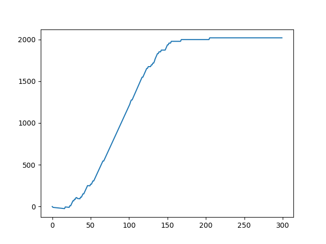

# Ingeligencja obliczeniowa
## Projekt 3: TS 1 - Podstawy Gymnasium
Olgierd Piofczyk, Kaja Dzielnicka

# Na 3.0

Zaimplementowano rozwiązywanie problemu w środowisku [`Taxi-v3` z Gymnasium](https://gymnasium.farama.org/environments/toy_text/taxi/).
Agentem jest taksówka, mająca za zadanie przewożenie pasażerów między wyznaczonymi miejscami na siatce 5x5. Agent może wykonać jedną z sześciu możliwych akcji: ruch na północ, południe, wschód, zachód, podjęcie pasażera oraz wysadzenie pasażera.

## Algorytm Q-learning
Zastosowano uczenie ze wzmocnieniem, konkretnie algorytmu [Q-learning](https://en.wikipedia.org/wiki/Q-learning).
W metodzie Q-learning kluczową role odgrywa tablica dyktująca agenta. Na początku inicjalizuje się ją bliskimi zera wartościami. Następnie agent w każdym kroku wybiera najlepszą wartość z tablicy Q i realizuje odpowiadający jej ruch. Do tego istnieje pewna szansa na zignorowanie tablicy i wykonanie losowego legalnego ruchu (tzw. eksploracja). Szansa na losową eksplorację maleje z kolejnymi epokami. Agent po wykonaniu ruchu dostaje ze środowiska nagrodę i na jej podstawie aktualizuje zawartość tablicy Q.

Algorytm Q-learning nie wymaga modelowania problemu, opiera się jedynie na doświadczeniach agenta.

## Implementacja
Implementacja skryptu rozpoczyna się od inicjalizacji środowiska, tabeli Q oraz parametrów algorytmu (np. współczynnik uczenia równy 0.9, współczynnik dyskontowania równy 0.9, szansę eksploracji początkowo równą 1 i malejącą w każdym kroku). W trakcie każdego epizodu agent podejmuje akcje bazując na obecnej polityce, następnie obserwuje nagrodę i nowy stan, po czym aktualizuje tabelę Q zgodnie z równaniem
$$Q(s, a) \leftarrow Q(s, a) + \alpha [r + \gamma \max_{a'} Q(s', a') - Q(s, a)]$$
Po zakończeniu epizodu wartość epsilon jest zmniejszana, co z czasem skutkuje mniejszą eksploracją i większą eksploatacją nauczonej polityki.

## Eksperymenty z AI
Ze wspomnianymi parametrami agent osiąga optymalne zachowanie po ok. 3000 iteracjach, co pokazuje poniższy wykres nagrody w zależności od iteracji.

