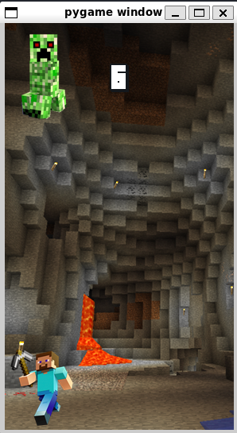
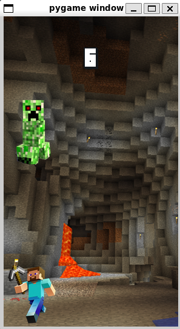

1.  Napisz własne dowolne środowisko Gymnasium.
2.  Napisz program rozwiązujący problem w utworzonym środowisku.
3.  Agentowi udaje się ukończyć grę / rozwiązać problem.
4.  Napisz sprawozdanie (około 2-3 strony A4), w którym opiszesz swoją implementację
środowiska i problemu, wykorzystany algorytm oraz przeprowadzone eksperymenty
z AI

# Środowisko
W naszym środowisku dzielny Ślązak musi unikać spadających mu na głowę goroli.

Po instalacji modułu grę uruchamia się komendą:
- `minecraft -m human` dla ręcznej kontroli
- `minecraft -m random` dla uruchomienia agenta wykonującego losowe ruchy

Implementując nasze środowisko wzorowaliśmy się na repozytorium `https://github.com/Talendar/flappy-bird-gym`. Środowisko zdefiniowane jest w `minecraft/envs/minecraft_env.py`, jest to środowisko dyskretne gdzie agent może w każdym ruchu wykonać jedną z 3 akcji (`class Actions`): - pozostanie w spoczynku
- ruch w lewo
- ruch w prawo

Gracz zdobywa punkt za każdego przeciwnika który rozbije się o podłogę, oraz traci punkty za każdego który go trafi. Gra kończy się po określonej z góry ilości ruchów.

# Agent